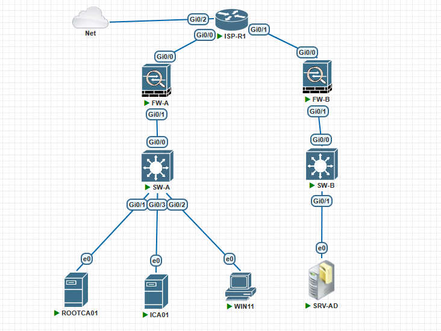

# Enterprise Security Lab

## Purpose

A reusable base topology for the CCIE Security study is shown below. It is designed as a small enterprise security environment. Before each new topic, a validated baseline lab topology will be cloned. Internet access is not required at this stage.

## Initial Topology

  

  <em>Figure 1 – The Baseline topology.</em>

## Roadmap

1. Base routing and management
2. PKI hierarchy
3. Device certificates
4. IKEv2
5. Site-to-site IPsec
6. AAA with RADIUS and TACACS+
7. Cisco ISE
8. 802.1X and EAP-TLS
9. TrustSec
10. Wireless security
11. API automation and telemetry
12. Zero Trust design

## Design Principles

- Use Cisco technologies with open standards.
- Build the lab incrementally, validate each phase before introducing new technologies.
- Preserve a known-good baseline before making major changes.
- Document every design decision, configuration, and validation step.
- Keep the Root CA logically offline after establishing the trust hierarchy.
- Never commit private keys, passwords, or sensitive material to Git.
- Design the topology so that new technologies can be added without redesigning the existing infrastructure.

## Files

| File | Purpose |
|---|---|
| `Lab-Inventory.md` | Installed images, device roles, and resource considerations |
| `Compatibility-Matrix.md` | Maps available images to planned lab capabilities |
| `IP-Addressing.md` | Interface, subnet, gateway, and reserved-address plan |
| `Device-Naming.md` | Hostname, DNS, certificate, and file-naming standards |
| `Topology.drawio` | Editable draw.io topology diagram |
| `Validation.md` | Acceptance tests for the base lab |
| `configs/` | Sanitised device configurations |
| `screenshots/` | Evidence used in the documentation |

## Version Plan

| Version | Milestone |
|---|---|
| `v1.0-base` | Devices deployed, addressed, routed, and validated |
| `v1.1-pki` | Root and Intermediate CA operational |
| `v1.2-certificates` | Device certificates issued and validated |
| `v2.0-ipsec` | Certificate-authenticated IKEv2/IPsec operational |
| `v3.0-identity` | AD, AAA, and Cisco ISE integration |
| `v4.0-access` | 802.1X, EAP-TLS, and TrustSec |
| `v5.0-wireless` | C9800 wireless security |
| `v6.0-automation` | APIs, automation, logging, and telemetry |
