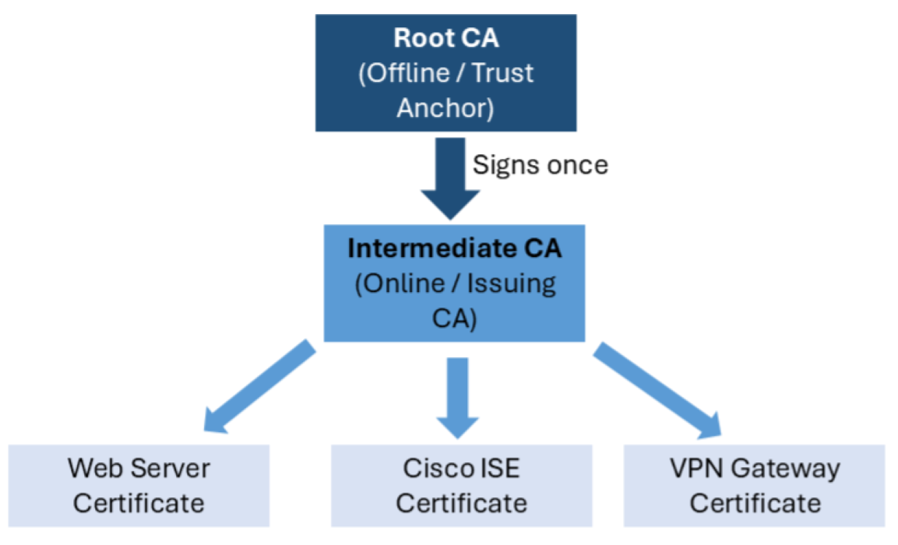

# 02 – Building the Root Certificate Authority (Root CA)

## Objective

Build a secure Root Certificate Authority (CA) using OpenSSL and understand why it forms the trust anchor of an enterprise Public Key Infrastructure (PKI).


## Why a Root CA?

Every PKI begins with a Root Certificate Authority (Root CA). It is the highest level of trust within the hierarchy and is responsible for issuing and signing certificates for subordinate Certificate Authorities (CAs).

Unlike other certificates, the Root CA is **self-signed** because there is no higher authority available to verify its identity.

The Root CA establishes the foundation of trust for every certificate issued within the enterprise/organisation. If the Root CA is trusted, every certificate issued beneath it can also be trusted through the certificate chain.


## Enterprise Architecture

A production PKI typically follows a hierarchical design.

<p align="center">
  
</p>

<p align="center">
  <em>Figure 1 – Typical enterprise PKI hierarchy showing the Root CA, Intermediate CA and issued certificates.</em>
</p>

Keeping the Root CA offline significantly reduces the risk of compromise. Day-to-day certificate issuance is performed by one or more Intermediate CAs, allowing the Root CA's private key to remain securely protected.


## Creating the PKI Directory Structure

OpenSSL requires a directory structure to store keys, certificates and Certificate Authority (CA) metadata.

```bash
mkdir -p ~/PKI/{private,certs,csr,newcerts,crl}

touch ~/PKI/index.txt

echo 1000 > ~/PKI/serial
```

Each component has a specific purpose.

| Directory/File | Purpose |
|---------------|---------|
| private | Stores private keys. Access should be tightly restricted. |
| certs | Stores issued certificates. |
| csr | Stores Certificate Signing Requests (CSRs). |
| newcerts | Stores certificates issued by the CA. |
| crl | Stores Certificate Revocation Lists (CRLs). |
| index.txt | Database of issued certificates. |
| serial | Tracks the next certificate serial number. |

This structure reflects how a production Certificate Authority maintains issued certificates and their associated metadata.


## Generating the Root Private Key

The Root CA private key is the most sensitive asset within the PKI. If compromised, every certificate issued by the Root CA becomes untrustworthy.

For my lab, a **4096-bit RSA** key will be used to provide long-term security while maintaining broad compatibility with enterprise systems.

```bash
openssl genpkey \
    -algorithm RSA \
    -pkeyopt rsa_keygen_bits:4096 \
    -out ~/PKI/private/rootca01.key
```

Restrict access to the private key.

```bash
chmod 600 ~/PKI/private/rootca01.key
```
Linux permissions are often represented as three digits: 6:Owner -> Read + Write; 0:Group -> No access; 0:Group -> No access

## Verifying the Private Key

The private key can be inspected to confirm that it was generated correctly.

```bash
openssl pkey \
    -in ~/PKI/private/rootca01.key \
    -text \
    -noout
```
`pkey`:works with private keys; `-in`:specified the input file; `-text`:displays the decoded mathematical components in a readable form; `-noout`:prevents OpenSSL from outputting the Base64-encoded PEM block again.

> **PEM (Privacy-Enhanced Mail)** is a Base64-encoded format used to store certificates, private keys and Certificate Signing Requests (CSRs). It is identified by headers such as:
>
> `-----BEGIN CERTIFICATE-----`
>
> and
>
> `-----END CERTIFICATE-----`

The output confirms the key length, public modulus and other RSA parameters that make up the private key.


## Creating the OpenSSL Configuration File

Rather than relying on OpenSSL defaults, an explicit configuration file defines the certificate subject and X.509 extensions.

Using configuration files improves consistency and produces certificates that more closely resemble those deployed in enterprise environments.

The Root CA configuration defines:

- Distinguished Name (DN)
- Hash algorithm
- Key Usage
- Basic Constraints
- Subject Key Identifier
- Authority Key Identifier


## Generating the Root Certificate

The Root CA certificate is created by signing its own public key using its private key.

```bash
openssl req \
    -new \
    -x509 \
    -config ~/PKI/openssl-root.cnf \
    -key ~/PKI/private/rootca01.key \
    -sha256 \
    -days 7300 \
    -set_serial 0x1000 \
    -out ~/PKI/certs/rootca01.crt
```

Unlike server certificates, the Root CA certificate does not require a Certificate Signing Request (CSR) because there is no higher Certificate Authority available to sign it.


## Verifying the Root Certificate

Inspect the certificate to confirm that the required fields and extensions have been applied.

```bash
openssl x509 \
    -in ~/PKI/certs/rootca01.crt \
    -text \
    -noout
```
 `x509`:Invokes the OpenSSL utility for reading, inspecting and managing X.509 certificates.
 `-text`:Displays the certificate contents in a human-readable format, including the certificate fields, public key, extensions and signature information.

Verify the following:

- Version 3 certificate
- SHA-256 signature algorithm
- Issuer and Subject are identical
- 4096-bit RSA public key
- Basic Constraints show **CA:TRUE**
- Key Usage includes **Certificate Sign** and **CRL Sign**

These extensions identify the certificate as a Certificate Authority capable of issuing certificates.


## Verifying Trust

Since the Root CA is self-signed, it can be used to verify its own certificate.

```bash
openssl verify \
    -CAfile ~/PKI/certs/rootca01.crt \
    ~/PKI/certs/rootca01.crt
```

A successful verification confirms that the certificate is internally consistent and that the signature matches the associated public key.


## Enterprise Considerations

Enterprise PKI deployments rarely use the Root CA for issuing certificates directly. Instead, the Root CA signs one or more Intermediate CAs, which perform routine certificate issuance.

Common enterprise practices include:

- Keeping the Root CA offline except when signing subordinate CAs.
- Protecting the Root private key using a Hardware Security Module (HSM).
- Distributing the Root certificate to trusted devices.
- Issuing certificates through Intermediate CAs rather than the Root CA.
- Using long validity periods for Root CA certificates due to their limited operational use.

This layered approach reduces operational risk while preserving the integrity of the PKI.


## Key Takeaways

- The Root CA is the trust anchor of the PKI.
- Root CAs are self-signed because no higher Certificate Authority exists.
- The Root private key is the most sensitive asset in the PKI.
- OpenSSL's directory structure mirrors the operational requirements of a production Certificate Authority.
- Enterprise PKI separates the Root CA from issuing CAs to minimise risk and protect the trust anchor.

## Further Reading

- UK National Cyber Security Centre (NCSC) – Provisioning and Managing Certificates in the Web PKI
  https://www.ncsc.gov.uk/guidance/provisioning-and-managing-certificates-in-the-web-pki

- AWS Private Certificate Authority – CA Hierarchy
  https://docs.aws.amazon.com/privateca/latest/userguide/ca-hierarchy.html